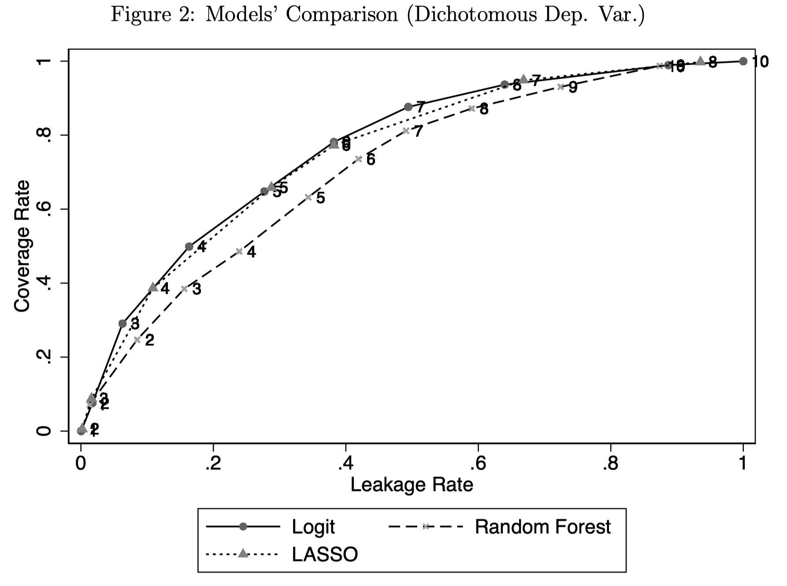

```{r setup, include=FALSE}
knitr::opts_chunk$set(echo = FALSE)
pacman::p_load(xaringan, tidyverse, estimatr, latex2exp, plotly, reactable, devtools)
```

```{r data, include = FALSE}
data = readRDS("Data/households") %>% 
  # Exclude three outliers (top 0.1 percent) in terms of income, probably a data error?
  filter(cpp < quantile(cpp, 0.999))

set.seed(1896)
index = sample(seq_len(nrow(data)), size = round(nrow(data)*0.5))

# Training data
data_train = data[index, ] %>% 
  # Create variable for the weight, such that weights sum to 1
  mutate(w = mult / sum(mult))

data_test = data[-index, ] %>% 
  # Create variable for the weight, such that weights sum to 1
  mutate(w = mult / sum(mult))
```

# Why Targeting 
.pull-left[
```{r plot_povertylines, echo=FALSE, warning=FALSE, fig.dim=c(7, 7)}
# Ideas. Make this a shiny plot and change the poverty line and the graph.

my_quantile <- function(x, w, p){
  oo <- order(x)
  cum.w <- cumsum(w[oo])/sum(w)
  cdf <- approxfun(cum.w, x[oo], yleft = min(x), yright = max(x), ties = min)
  return(cdf(p))
}

q = 0.2
z = my_quantile(data_train$cpp / 12, w = data_train$w, p = q)
dens = density(data_train$cpp / 12, weights = data_train$w)

plot1 <- ggplot(data_train) +
  geom_density(aes(x = cpp / 12, weight = w), color = "black") +
  geom_vline(xintercept = z, color = "red", alpha = 0.8) +
  geom_ribbon(data = subset(with(dens, data.frame(x,y)), x < z), aes(x = x, ymax = y), ymin = 0, fill = "gray", alpha = 0.5) +
  annotate(geom = "text", x = z + 1000, y = 0.00001, label = parse(text = latex2exp::TeX('$F(z) = \\sum(y_i \\leq z)$')), hjust = "inward") +
  annotate(geom = "text", x = z + 1000, y = 0.000008, label = paste0("F(", format(z, digits = 1, big.mark = ","), ") = ", q), color = "red", hjust = "inward") +
  scale_x_continuous(labels = scales::comma) +
  labs(x = "Monthly per capita consumption",
       y = NULL) +
  coord_cartesian(xlim = c(0, 100000)) +
  theme_minimal() +
  theme(panel.grid.major = element_blank(),
        panel.background = element_blank(),
        axis.text.y = element_blank())

plot1
```
]

.pull-right[
- Determine eligibility for a program.
- Which measure? Which cut-off?

> Consumption (Brown et al.; Verme), Rankings (Martin), ...
> Absolute poverty (line) or relative poverty (rate)

- The relevant measure may not be available for the entire sample `r emo::ji("cry")`
- The relation between poverty line and poverty rate may be unknown `r emo::ji("cry")`
]

???
- Income distribution of the Uganda LSMS-ISA Training dataset (random subset of 50%).
- If we know the income distribution we can set the poverty rate such that it exactly encompasses the chosen poverty line.
But, if we do not know the income distribution we need to fix one of the two and the predicted distribution may be off (next slide).

---

.pull-left[
## How it started 
```{r plot_povertylines2, echo=FALSE, fig.dim=c(5,5), warning=FALSE}
# Linear regression with robust standard errors (Stata style), not yet clustered at PSU level (where is PSU variable in WB data?)
basicpmt <- paste("toilet_flush", "toilet_pit", "floor_finished", "wall_finished", 
                  "roof_finished", "fuel_electric_gas", "fuel_coal", "urban",
                  "head_age_fct", "head_female", "head_educ_primary", "head_educ_secondary", 
                  "head_divorced", "head_widow", "head_work_salary", "head_work_selfemployed",
                  "shares_f_5", "shares_m_5", "shares_f_14", "shares_m_14", "shares_f_65", "shares_m_65",
                  "hhsize_fct", "month", "region",
                  sep = " + ")
basicpmt <- formula(paste("log(cpp) ~", basicpmt))
basicpmt <- lm_robust(basicpmt, data_train, weights = mult, se_type = "stata", clusters = region)
bpmt <- tibble(yhat = exp(basicpmt$fitted.values),
               y = exp(unlist(model.frame(basicpmt)[basicpmt$outcome])),
               w = data_train$mult / sum(data_train$mult))  

basicpmt_test <- predict(basicpmt, newdata = data_test)
bpmt_test <- tibble(yhat = exp(basicpmt_test),
               y = data_test$cpp,
               w = data_test$mult / sum(data_test$mult)) 

ggplot(bpmt) +
  geom_density(aes(x = y / 12, weight = w), color = "firebrick") +
  geom_vline(xintercept = z-500, color = "gray", alpha = 0.8) +
  geom_ribbon(data = subset(with(dens, data.frame(x,y)), x < z), aes(x = x, ymax = y), ymin = 0, fill = "firebrick", alpha = 0.3) +
  annotate(geom = "text", x = z - 8000, y = 0.000013, label = paste0("F(", format(z, digits = 1, big.mark = ","), ") = ", q), hjust = "outward", size = 3, color = "firebrick") +
  scale_x_continuous(labels = scales::comma) +
  labs(x = "Monthly per capita consumption",
       y = NULL,
       title = "Uganda LSMS-ISA, Training Data") +
  coord_cartesian(xlim = c(0, 40000), ylim = c(0, 0.00004)) +
  theme_minimal() +
  theme(panel.grid.major = element_blank(),
        panel.background = element_blank(),
        axis.text.y = element_blank())


```
]

.pull-right[
## How it's going
```{r poverty_prediction, echo = FALSE, warning = FALSE, fig.dim = c(5,5)}
z = my_quantile(data_test$cpp / 12, w = data_test$w, p = q)
dens = density(data_test$cpp / 12, weights = data_test$w)
z_hat = my_quantile(bpmt_test$yhat / 12, w = bpmt_test$w, p = q)
dens2 = density(bpmt_test$yhat / 12, weights = bpmt_test$w)

plot2 <- ggplot(bpmt_test) +
  geom_density(aes(x = y / 12, weight = w), color = "gray") +
  geom_vline(xintercept = z-500, color = "gray", alpha = 0.8) +
  geom_ribbon(data = subset(with(dens, data.frame(x,y)), x < z), aes(x = x, ymax = y), ymin = 0, fill = "gray", alpha = 0.3) +
  annotate(geom = "text", x = z - 8000, y = 0.000013, label = paste0("F(", format(z, digits = 1, big.mark = ","), ") = ", q), hjust = "outward", size = 2.5) +
  scale_x_continuous(labels = scales::comma) +
  labs(x = "Monthly per capita consumption",
       y = NULL,
       title = "Uganda LSMS-ISA Testing Data",
       subtitle = "True income distribution vs. predicted based on basic PMT model") +
  coord_cartesian(xlim = c(0, 40000), ylim = c(0, 0.00004)) +
  theme_minimal() +
  theme(panel.grid.major = element_blank(),
        panel.background = element_blank(),
        axis.text.y = element_blank())

plot2 +
  geom_density(aes(x = yhat / 12, weight = w), color = "firebrick") +
  geom_vline(xintercept = z_hat-200, color = "firebrick", alpha = 0.8) +
  geom_ribbon(data = subset(with(dens2, data.frame(x,y)), x < z_hat), aes(x = x, ymax = y), ymin = 0, fill = "firebrick", alpha = 0.3)+
  annotate("text", x = z_hat - 3000, y = 0.00003, label = paste0("F(", format(z_hat, digits = 1, big.mark = ","), ") = ", q), hjust = "outward", size = 2.5, color = "firebrick")
  


  
```

]

- Fix poverty line at 14,925 is too low to reach the targeted 20 percent in the testing data.
- Fix poverty rate at 16,063 (for 20 percent) is too high to reach the targeted 20 percent.

???
- Left is observed training data income distribution. Right is predicted income distribution for testing data, but the true underlying income distribution is not observed.
- Again LSMS-ISA Uganda. OLS model like in Brown et al.
- Brown et al. look at both and recommend in practice to fix the poverty rate (focus on exclusion error), Verme fixes poverty line and compares model performance when poverty line changes. 

---
name: modelling

# A combined framework 
### Brown et al. & Verme

1. **Modelling**:
    $$ 
    \begin{align}
    y_i = \alpha + \beta x_i + \varepsilon_i \\\\
    1(y_i \leq z) = \alpha' + \beta' x_i + \epsilon_i
    \end{align}
    $$
Choice of outcome (consumption or poverty) and model (Verme: OLS/Logit + Random Forest and LASSO)<sup>1</sup>: 6 models

2. **Prediction** (out of sample):
    $$ 
    \begin{align}
    \hat{y_i} = \hat{\alpha} + \hat{\beta} x_i \\\\
    \hat{p}_i = P[y_i \leq z | x_i] = \hat{\alpha}' + \hat{\beta}' x_i + \epsilon_i
    \end{align}
    $$

.footnote[
[1] This is the part where Brown et al. compare OLS, quantile regression, *"poverty-weighted least-square"* for basic and extended set of covariates.
]

???
- Point for discussion: how important is training and testing versus simply estimating the model.
- Smaller point, Verme splits error term into a random error and a modelling error, but those are not separately identifiable.

---
## A combined framework (cont.)
1. Modelling: $y_i = \alpha + \beta x_i + \varepsilon_i$

2. Prediction: $\hat{y_i} = \hat{\alpha} + \hat{\beta} x_i$
<hr>

3. **Classification**:
Use the predictions to classify into poor or non-poor
    $$ 
    \begin{align}
    y_i \rightarrow \text{poor if }&\enspace \hat{y_i} \leq z \\\\
    1(y_i \leq z) \rightarrow \text{poor if }&\enspace \hat{p}_i \geq \tau
    \end{align}
    $$
$\tau$ is a pre-specified probability cut-off (unclear what Verme uses).

---

name: classificationerrors

<script>
   function setColor(color){ 
    document.getElementById("TN").style.backgroundColor='white';
    document.getElementById("FP").style.backgroundColor='white';
    document.getElementById("TP").style.backgroundColor='green';
    document.getElementById("FN").style.backgroundColor='red';
};
</script>

<script>
   function setColor2(color){ 
    document.getElementById("TP").style.backgroundColor='white';
    document.getElementById("FN").style.backgroundColor='white';
    document.getElementById("TN").style.backgroundColor='green';
    document.getElementById("FP").style.backgroundColor='red';
};
</script>

# All classifications will have errors
Poverty Confusion Matrix

<table>
    <tr>
      <td> <td>
      <th> Predicted Non-Poor <th>
      <th> Predicted Poor <th>
    <tr>
    <tr>
      <th> Real Non-Poor <th>
      <td id="TN">True Negative (TN)<td>
      <td id="FP">False Positive (FP)<td>
    <tr>
    <tr>
      <th> Real Poor <th>
      <td id="FN">False Negative (FN)<td>
      <td id="TP">True Positive (TP)<td>
</table>

To evaluate different models we need a targeting measure (Verme: "*objective function*").  

Verme: "coverage rate" (= 1 - Exclusion Error Rate, $1-\frac{\sum 1(\hat{y}_i > z | y_i \leq z)}{\sum 1(y_i\leq z)}$) <input id="button1" type="button" value="show" onclick="setColor('red')">  
Verme: "leakage rate" (= Inclusion Error Rate, $\frac{\sum 1(y_i > z | \hat{y}\leq z)}{\sum 1(\hat{y}_i \leq z)}$)<input id="button2" type="button" value="show"  onclick="setColor2('red')">

And some [additional measures](#measures)

???
We need a way to evaluate the different predictions. Typically we use the mean squared error: $\frac{1}{N}\sum_{i=1}^N(y_i - \hat{y}_i)^2$. But here we do not care about all errors equally. Instead, formulate targeting measure in terms of coverage of program.

Exclusion Rate is share of true poor which are misclassified as non-poor. True poor are wrongly excluded.
Inclusion Rate is share of predicted poor (Ravallion, true poor Verme) which are misclassified as poor. True non-poor are wrongly included.

---

# Verme: Data and Results
- 7062 households (3482 in testing data). 
- 6 models (OLS, Logit, Random Forest x2 , LASSO x2) at *"simplest Stata specification."*
- Simplest consumption model: gender, age, marital status and skills of the head of the household, household size and urban-rural location

```{r vermeplot, include = FALSE, warning = FALSE, echo=FALSE, fig.align='center', fig.dim=c(5,5)}
verme_results <- tibble(Value = c(0.40, 0.33, 0.40, 0.30, 0.35, 0.30,
                                  0.24 , 0.34, 0.24, 0.31, 0.36, 0.31,
                                  0.70, 0.64, 0.70, 0.68, 0.62, 0.68,
                                  0.68, 0.64, 0.70, 0.68, 0.62, 0.68),
                        Model = rep(c("OLS", "Random Forest", "LASSO",
                                      "Logit", "Random Forest", "LASSO"), 4),
                        Measure = c(rep("Undercoverage (EER)", 6), rep("Leakage (IER)", 6),
                                    rep("Precision", 6), rep("Accuracy", 6)),
                        Outcome = rep(c(rep("Continuous", 3), rep("Binary", 3)), 4))

vermeplot <- verme_results %>% 
  ggplot(aes(x = value, y = model, color = measure)) +
  geom_point() +
  facet_wrap("outcome", nrow = 2, scales = "free_y", strip.position = "top") +
  labs(y = NULL, x = NULL, color = NULL) +
  theme_minimal() +
  theme(legend.position = "bottom")

# ggplotly(vermeplot, tooltip = "color", dynamicTicks = FALSE)

```

```{r vermetable}
verme_results_pivot <- verme_results %>% pivot_wider(names_from = c("Outcome", "Model"), values_from = "Value")

reactable(verme_results_pivot, 
          columns = list(Continuous_OLS = colDef(name = "OLS"),
                         `Continuous_Random Forest` = colDef(name = "Random Forest"),
                         Continuous_LASSO = colDef(name = "LASSO"),
                         Binary_Logit = colDef(name = "Logit"),
                         `Binary_Random Forest` = colDef(name = "Random Forest"),
                         Binary_LASSO = colDef(name = "LASSO"),
                         Measure = colDef(name = "Measure", minWidth = 140)),
          columnGroups = list(colGroup(name = "Continuous", columns = c("Continuous_OLS", "Continuous_Random Forest", "Continuous_LASSO")),
                              colGroup(name = "Binary", columns = c("Binary_Logit", "Binary_Random Forest", "Binary_LASSO"))),
          defaultColDef = colDef(align = "left", headerStyle = list(background = "#f7f7f8")),
          bordered = T,
          highlight = T,
          defaultPageSize = 2)
```


???
- You can tell that it is a working paper...
- Undisclosed middle-income-country
- Poverty line set at median value. But unclear how exactly, probably look at the median value of the training data (or the entire data?).
- Points to discuss: with so few variables, using regularization techniques like LASSO and Random Forest makes little sense.
- Brown et al. had IER of 0.2-0.35 and EER of 0.25-0.45 for poverty line at 40 percent.

---
# Verme: Coverage Curves
```{r coverage_curves, fig.retina=0.9, fig.align='center'}

```

???
- Verme plots coverage (1-EER) and leakage (IES) rate for different values of the poverty line for all three models. Unclear results, most clear for binary outcome and random forest dominated by logit and lasso.
- Question: Is this the right comparison? The poverty line does not vary as much so it seems there are other parameters for which we would like to know how the dominance of models varies. Most notably we would want first a measure of precision, no?

---
# Application: Uganda LSMS

- 2744 observations and split them equally into training and testing data.

- For fixed poverty line at $z=F^{-1}(0.2)$ and fixed poverty rate at H=0.2, I calculate Headcount, IER and EER or TER using the basic and extended OLS model like in Brown et al. and add LASSO and Random Forest models.

- Make 500 repeated testing - training splits and re-estimate the models to get bootstrapped precisions for the Headcount, IER, EER and TER prediction errors.

- [Many limitations and to-do's](#limitations)

???
I was not convinced by the comparisons in the Verme paper. So, I did it again for the Uganda LSMS-ISA dataset which is used in the Brown et al. paper. The dataset has 2744 observations after cleaning everything, attempting to do it exactly like the Brown et al. paper. There are a couple of limitations (most importantly survey weights) but its a start.
- Addition to Brown et al. Add machine learning techniques (LASSO and Random Forest) and divide into testing and training.
- Addition to Verme. Use a more sophisticated consumption model where the ML techniques may have an advantage. Although it would still be better to have interaction terms and polynomials.
- And then, I also get estimates of the precision of the predictions with the competing algorithms.

---
name: myresults

```{r uganda_application, echo = FALSE, warning = FALSE}
results = readRDS("../Replication Brown, Ravallion, van de Walle/Data/prepared/results")
bootstraps = readRDS("../Replication Brown, Ravallion, van de Walle/Data/prepared/boot_results")

```

## My results

```{r uganda_results, echo = FALSE, fig.align='center'}
results %>% 
  filter(z == 0.2, measure != "H") %>% 
  mutate(covariates = paste(covariates, "\n Covariates")) %>% 
  mutate(measure = fct_recode(measure, "Exclusion Error Rate" = "EER", "Inclusion Error Rate" = "IER", "Targeting Error Rate" = "TER")) %>% 
  ggplot(aes(x = mean, y = fct_rev(covariates), colour = model, group = model)) +
  facet_wrap(facets = c("measure"), ncol = 3, scales = "free") +
  # Print confidence intervals
  ggstance::geom_pointrangeh(aes(xmin = ci_low, xmax = ci_high), position = position_dodge(width = 0.2)) +
  geom_point(aes(x = value_insample), shape = 3, color = "black", position = position_dodge(width = 0.2)) +
  scale_color_brewer(type = "qual", palette = "Pastel2") +
  labs(y = NULL, x = NULL, color = NULL, title = "Performance of different targeting methods (z=0.2).",
       caption = "Average of bootstrap estimates and 90% confidence intervals, constructed with 500 random train / test splits. Cross shows in-sample result.") +
  guides(color = guide_legend(label.position = "top", direction = "horizontal", order = 1)) +
  theme_minimal() +
  theme(legend.position = "bottom", panel.grid.minor.x = element_blank())
```
[Results for z=0.4](#ownz4results)

???
Brown et al. had IER = 0.403, EER = 0.619 and TER 0.344 for poverty line at 20 percent.

---

### Poverty rate at predicted poverty lines
```{r hresults, fig.align='center'}
results %>% filter(measure == "H", covariates == "Basic") %>% mutate(colorcode = if_else(mean-z<0, "red", "green"))  %>% 
  ggplot(aes(x = mean, y = model)) + 
  geom_vline(xintercept = c(0.2, 0.4), color = "black") +
  geom_pointrange(aes(xmin = z, xmax = mean, color = colorcode), shape = 18, size = 1) +
  scale_color_manual(values = c("darkgreen", "firebrick")) +
  labs(y = "Model", x = "Poverty rate: targeted versus result (at 0.2 or 0.4)",
       title = "Fixing the poverty line results in an underestimated poverty rate for low poverty rates.") +
  theme_minimal() +
  theme(legend.position = "none", panel.grid.major.y = element_blank(), title = element_text(size = 9))
```


---
# Questions

- In-sample versus out-of-sample testing. Is this crucial? Verme says: 
    > The choice of the optimal model depends on the location of the poverty line, the choice of objective function and the particular income distribution at hand. Unlike current practices, it is essential to test alternative models and perform stochastic dominance analysis before selecting the optimal model 

How can we do this if we don't have the data and need to do out-of-sample validation?

- How important is it to consider the precision of targeting models? Bootstrap reflects sampling uncertainty, but what if we have data of whole population?

---
name: measures

### More Targeting Measures

- Specificity Rate = 1 - Leakage Rate
- Precision = TP/(TP+FP) *share of all predicted poor that are poor*
- Accuracy = (TP+TN)/(TP+TN+FP+FN) *share of all observations correctly classified*
- F2 = $5*TP/(5*TP+4*FN+FP)$ `r emo::ji("confused")`
- Chi2 = $\sum\frac{(O_{ij}-E_{ij})^2}{E_{ij}}$ `r emo::ji("wow")`
- Chi2 likelihood ratio

 <hr>

[Back to presentation](#classificationerrors)

---
name: limitations

### Limitations of Uganda Application
- Survey weights are not used (not trivial with LASSO and Random Forest)
- Clustering at region (ok) and PSU level (where in data?)
- Correct bootstraps? Some people train on full sample and validate on sub-sample. I randomly split data but could also sample random subsets. Point estimate, first draw or average of bootstraps?

<hr>
[To results of application](#myresults)

---
name: ownz4results

## My results
```{r uganda_results4, echo = FALSE, fig.align='center'}
results %>% 
  filter(z == 0.4, measure != "H") %>% 
  mutate(covariates = paste(covariates, "\n Covariates")) %>% 
  mutate(measure = fct_recode(measure, "Exclusion Error Rate" = "EER", "Inclusion Error Rate" = "IER", "Targeting Error Rate" = "TER")) %>% 
  ggplot(aes(x = mean, y = fct_rev(covariates), colour = model, group = model)) +
  facet_wrap(facets = c("measure"), ncol = 3, scales = "free") +
  # Print confidence intervals
  ggstance::geom_pointrangeh(aes(xmin = ci_low, xmax = ci_high), position = position_dodge(width = 0.2)) +
  # geom_point(aes(x = value_insample), shape = 3, color = "black", position = position_dodge(width = 0.2)) +
  scale_color_brewer(type = "qual", palette = "Pastel2") +
  labs(y = NULL, x = NULL, color = NULL, title = "Performance of different targeting methods (z=0.4).",
       caption = "Average of bootstrap estimates and 90% confidence intervals, constructed with 500 random train / test splits.") +
  guides(color = guide_legend(label.position = "top", direction = "horizontal", order = 1)) +
  theme_minimal() +
  theme(legend.position = "bottom", panel.grid.minor.x = element_blank())
```


[Back to main results](#myresults)

???
Brown et al. had IER = 0.28, EER = 0.486 and TER 0.326 for poverty line at 40 percent.